# Getting Started with the SharePoint Framework (SPFx) #
In this lab, you will walk through an introduction of the SharePoint Framework, setting up a development environment, building hello world web parts with different web frameworks and getting them up and running within the SharePoint workbench.

## Introducing SharePoint Framework ##

### What is the SharePoint Framework? ###

For more information on this topic please see [https://dev.office.com/sharepoint](https://dev.office.com/sharepoint).

### Why the SharePoint Framework? ###

For more information on this topic please see [this](https://dev.office.com/sharepoint/docs/spfx/sharepoint-framework-overview) article.

## Setup development environment ##

For more information on this topic please see the [Set up your development environment](http://dev.office.com/sharepoint/docs/spfx/set-up-your-development-environment) article.

You can use Visual Studio, or your own custom development environment to build SharePoint client-side web parts. You can use a Mac, PC, or Linux.

### Install developer tools ###

#### NodeJS ####

Install [NodeJS](https://nodejs.org/en/) Long Term Support (LTS) version.
- If you have NodeJS already installed please check you have the latest version using node -v. It should return the current [LTS version](https://nodejs.org/en/download/).
- If you are using a Mac, it is recommended you use [homebrew](http://brew.sh/) to install and manage NodeJS.

After installing node, make sure npm is up to date by running following command:

````shell
npm install -g npm
````

In case of Linux previous command might result in 'permission denied' message, so it should be instead executed as

````shell
sudo npm install -g npm
````

#### Code Editors ####

Install a code editor. You can use any code editor or IDE that supports client-side development to build your web part, such as:
- [Visual Studio Code](https://code.visualstudio.com/)
- [Atom](https://atom.io/)
- [Webstorm](https://www.jetbrains.com/webstorm)

The steps and code samples in this training use Visual Studio Code, but you can use any editor of your choice.

#### If you are using Ubuntu ####

You need to install compiler tools using the following command:
````shell
sudo apt-get install build-essential
````

#### If you are using fedora ####

You need to install compiler tools using the following command:
````shell
sudo yum install make automake gcc gcc-c++ kernel-devel
````

### Install Yeoman and gulp ###

[Yeoman](http://yeoman.io/) helps you kick-start new projects, and prescribes best practices and tools to help you stay productive. SharePoint client-side development tools include a Yeoman generator for creating new web parts. The generator provides common build tools, common boilerplate code, and a common playground web site to host web parts for testing.

Enter the following command to install Yeoman and gulp:
````shell
npm install -g yo gulp
````

### Install Yeoman SharePoint generator ###

The Yeoman SharePoint web part generator helps you quickly create a SharePoint client-side solution project with the right toolchain and project structure.
Enter the following command to install the Yeoman SharePoint generator:
````shell
npm install -g @microsoft/generator-sharepoint
````

### AMD Modules ###

**Asynchronous module definition (AMD)** is a JavaScript specification that defines an API for defining code modules and their dependencies, and loading them asynchronously if desired. Implementations of AMD provide the following benefits:
- Website performance improvements. AMD implementations load smaller JavaScript files, and only load them when they are needed.
- Fewer page errors. AMD implementations allow developers to define dependencies that must load before a module is executed, so the module does not try to use outside code that is not yet available.

For more information on **AMD**, please see [this](https://en.wikipedia.org/wiki/Asynchronous_module_definition).

SharePoint Framework supports both AMD and non-AMD javascript libraries, but recommend to avoid using non-AMD javascript libraries when possible. For more information, please see:
- [JavaScript libraries formats](https://dev.office.com/sharepoint/docs/spfx/web-parts/guidance/use-existing-javascript-libraries#javascript-libraries-formats)
- [Non-AMD scripts considerations](https://dev.office.com/sharepoint/docs/spfx/web-parts/guidance/use-existing-javascript-libraries#non-amd-scripts-considerations)

### Optional tools ###

Here are some tools that might come in handy as well:
- [Fiddler](http://www.telerik.com/fiddler)
- [Postman plugin for Chrome](https://www.getpostman.com/docs/introduction)
- [Cmder for Windows](http://cmder.net/)
- [Oh My Zsh for Mac](http://ohmyz.sh/)
- [Git source control tools](https://git-scm.com/)

## SharePoint Framework Client-side Components ##

### Introduce SPFx components

SharePoint Framework helps you to extend key SharePoint experiences using client-side components.  Today, client-side web parts allow developers to build components that page authors can extend SharePoint pages experience. As we introduce new SharePoint experiences, the framework will provide the respective client-side components to extend such experiences. 

### Client-side web part ###

SharePoint client-side web parts are controls that appear inside a SharePoint page but run locally in the browser. They're the building blocks of pages that appear on a SharePoint site. You can build client-side web parts using modern script development tools and the SharePoint workbench (a development test surface), and you can deploy your client-side web parts to classic web part pages in Office 365 Developer tenants. In addition to plain JavaScript projects, you can build web parts alongside common scripting frameworks, such as AngularJS and React. For example, you can use React along with components from Office UI Fabric React to quickly create experiences based on the same components used in Office 365.

For more information on this topic please see [this](https://dev.office.com/sharepoint/docs/spfx/web-parts/overview-client-side-web-parts) article.

## Setup Office 365 tenant ##

For more information on this topic please see the [Set up your developer tenant](http://dev.office.com/sharepoint/docs/spfx/set-up-your-developer-tenant) article.

To build and deploy client-side web parts using SharePoint Framework, you will need an Office 365 tenant.

### Sign up for an Office 365 Developer Tenant ###

If you already have an Office 365 tenant, see [create your app catalog site](#create-app-catalog-site).

If you don't have one, sign up for the [Office Developer Program](https://profile.microsoft.com/RegSysProfileCenter/wizardnp.aspx?wizid=7a6e3d71-b057-49cc-b2aa-158ff23432f3&lcid=1033). You will receive a welcome mail with a link to sign up for an Office 365 Developer Tenant.

> **Note:** Make sure that you are signed out of any existing Office 365 tenants before you sign up.

### Create app catalog site ###

You will need an app catalog to upload and deploy web parts. If you've already set up an app catalog, see [create a new Developer Site collection](#create-a-new-developer-site-collection).

1. Go to the **SharePoint Admin Center** by entering [https://yourtenantprefix-admin.sharepoint.com](https://yourtenantprefix-admin.sharepoint.com) in your browser. Replace **yourtenantprefix** with your Office 365 Developer Tenant prefix.
2. In the left sidebar, choose the **apps** menu item and then choose **App Catalog**.
3. Choose **OK** to create a new app catalog site.
	
	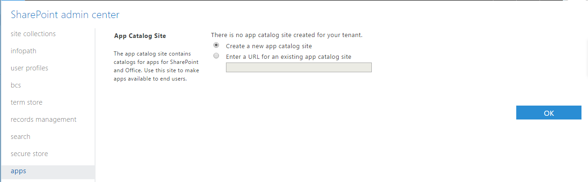

4. In the next page, enter the following details:
	- **Title**: Enter **App Catalog**.
	- **Web Site Address *suffix***: Enter your preferred address suffix for app catalog; for example: **apps**.
	- **Administrator**: Enter your username and choose the **Check Names** button to resolve the username.
5. Choose **OK** to create the app catalog site.
	
	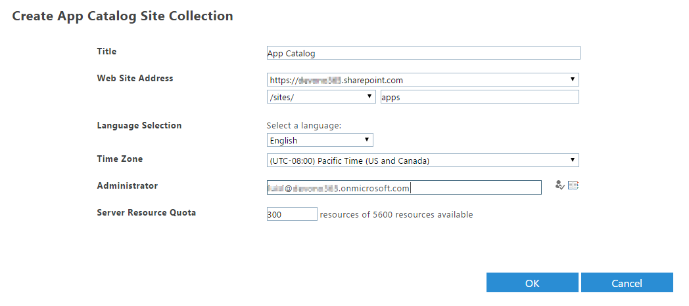

SharePoint will create the app catalog site and you will be able to see its progress in the SharePoint admin center.

### Create a new Developer Site collection ###
You also need a Developer Site.

1. Go to the **SharePoint Admin Center** by entering [https://yourtenantprefix-admin.sharepoint.com](https://yourtenantprefix-admin.sharepoint.com) in your browser. Replace **yourtenantprefix** with your Office 365 Developer Tenant prefix.
2. In the SharePoint ribbon, choose **New** -> **Private Site Collection**.
3. In the dialog box, enter the following details:
	- **Title**: Enter a title for your developer site collection; for example: **Developer Site**.
	- **Web Site Address *suffix***: Enter a address suffix for your developer site collection; for example: **dev**.
	- **Template Selection**: Select **Developer Site** as the site collection template.
	- **Administrator**: Enter your username and choose the **Check Names** button to resolve the username.
4. Choose **OK** to create the site collection.
	
	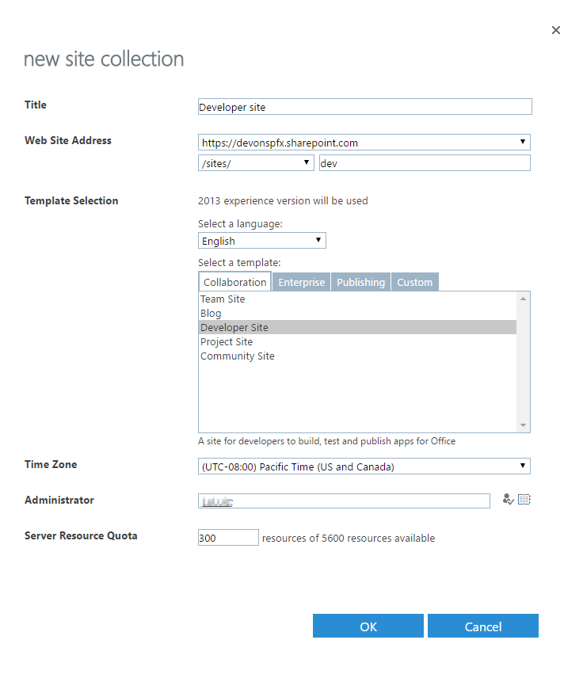

SharePoint will create the developer site and you will be able to see its progress in the SharePoint admin center. After the site is created, you can browse to your developer site collection.

### SharePoint Workbench ###

SharePoint Workbench is a developer design surface that enables you to quickly preview and test web parts without deploying them in SharePoint. SharePoint Framework developer toolchain contains a version of the Workbench that works locally and helps you quickly test and validate solutions you are building. It is also hosted in your tenancy to preview and test your local web parts in development. You can access the SharePoint Workbench from any SharePoint site in your tenancy by browsing to the following URL:
````
https://your-sharepoint-site/_layouts/workbench.aspx
````

## Exercise 1: Create a hello world web part without any framework
In this exercise you will create a hello world web part without any framework.

1. Open a **Command Prompt** window.
2. Change to the directory where you will create the web part.

	> **Note:** Directory paths can become quite long after node modules are imported.  **We suggest you use a directory name without spaces in it and create it in the root folder of your drive.**  This will make working with the web part easier in the future and protect you from potential issues associated with long file paths.
	> In this example, we use **c:\SPFx** as the working directory.

3. Type **md helloworld-webpart** and press **Enter**.
	
	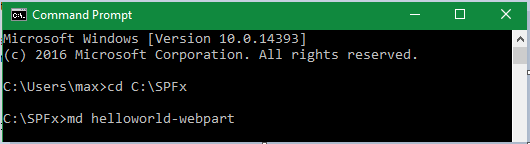

4. Type **cd helloworld-webpart** and press **Enter**.
	
	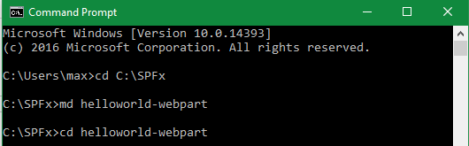

### Run the Yeoman SharePoint Generator ###

1. Type **yo @microsoft/sharepoint** and press **Enter**.
	
	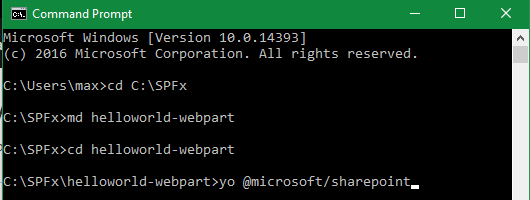

2. When prompted:

	1.	Accept the default **helloworld-webpart** as your solution name and press **Enter**.
	2.	Select **Use the current folder** for where to place the files and press **Enter**.

3. The next set of prompts asks for specific information about your web part:

	1.	Accept the default **No javascript web framework** as the framework you would like to use and press **Enter**.
	2.	Accept the default **HelloWorld** as your web part name and press **Enter**.
	3.	Accept the default **HelloWorld description** as your web part description and press **Enter**.
	
	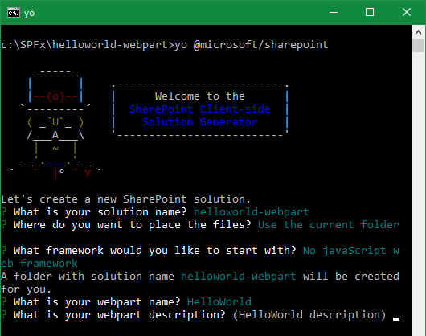

	>**Note:** At this point, Yeoman will install the required dependencies and scaffold the solution files along with the HelloWorld web part. This might take a few minutes.
	>When the scaffold is complete, you should see the following message indicating success.
	>
	>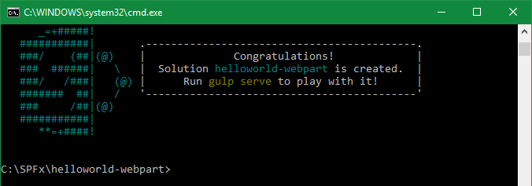
	
### Preview your web part ###

1. Make sure you are still in the **helloworld-webpart** directory.
2. If you haven't installed and trusted a developer certificate, type **gulp trust-dev-cert** and press **Enter**.
	
	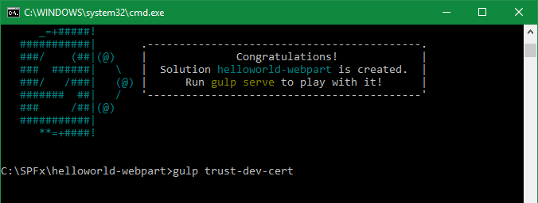

	> **Note:** The client-side toolchain uses HTTPS endpoint by default. However, since a default certificate is not configured for the local dev environment, your browser will report a certificate error. The command above installs and trusts a developer certificate used by HTTPS endpoint.
	> 
	> You only need to do this once per machine, not once per project. If you have done this in another project, please ignore this step.

3. Type **gulp serve** and press **Enter**.
	
	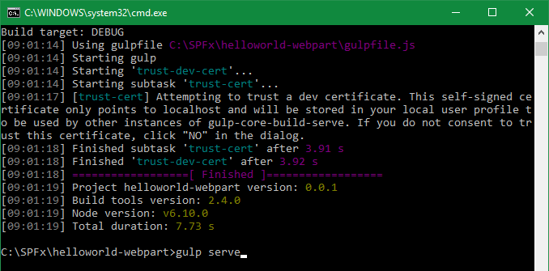

	> **Note:** This command executes a series of gulp tasks to create a local, Node-based HTTPS server on 'localhost:4321' and launches your default browser to preview web parts in your local dev environment.
	> 
	> Mozilla Firefox doesn't trust self-signed certificate. If you're using Mozilla Firefox, you will need to choose **Advanced** and add an exception to proceed to the website.
	> 
	>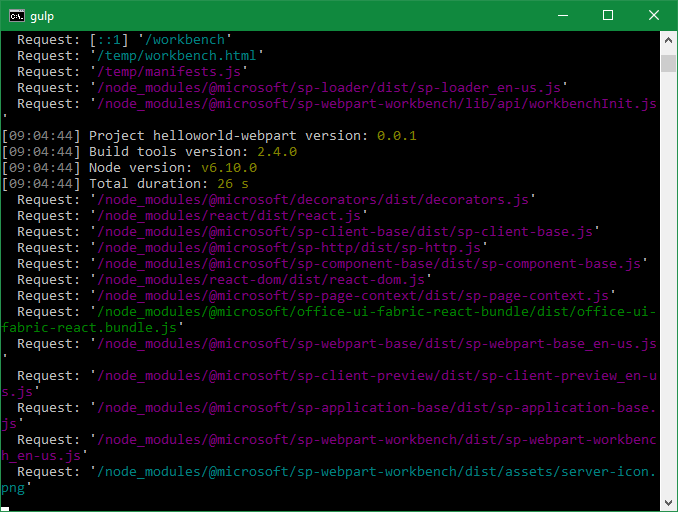

4. Switch to your default browser and make sure the **workbench.html** page has opened.

	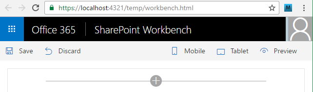

5. To add the **HelloWorld** web part, choose the **plus** button.

	>**Note:** The plus button opens the toolbox where you can see a list of web parts available for you to add. The list includes the **HelloWorld** web part as well other web parts available in your local development environment.

6. Choose **HelloWorld** to add the web part to the page.

	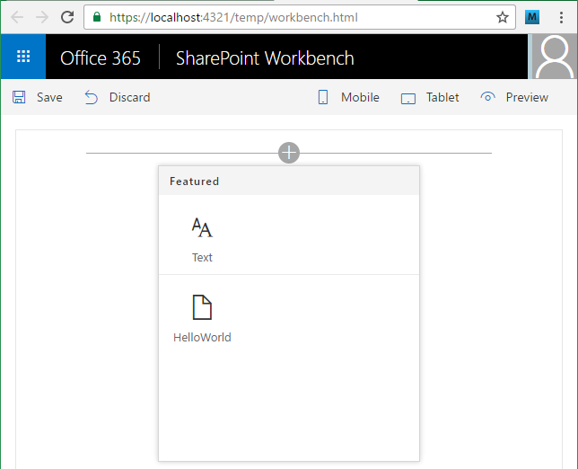

Congratulations! You have just added your first client-side web part to a client-side page.

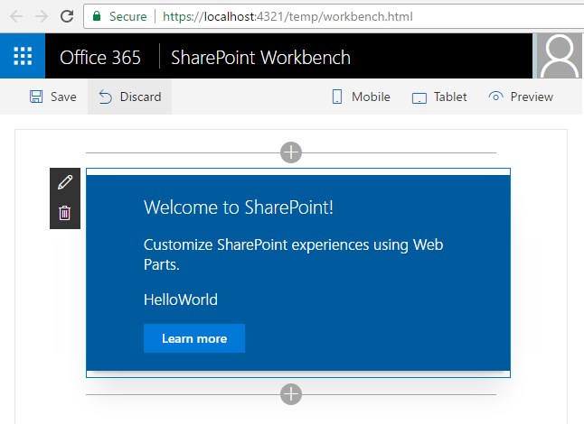

### Modify the web part's description property ###

1. Choose the pencil icon on the top left side of the web part to reveal the web part property pane.

	>**Note:** The property pane is where you access properties to customize your web part. The property pane is client-side driven and provides a consistent design across SharePoint.

2. Modify the text in the **Description** text box to **Client-side web parts are awesome!**

	

3. Notice how the text in the web part also changes as you type.
	
	>**Note:** One of the new capabilities available to the property pane is to configure its update behavior, which can be set to reactive or non-reactive. By default the update behavior is **reactive** and enables you to see the changes as you edit the properties. The changes are saved instantly as when the behavior is reactive. This is the behavior you observed in this exercise.

Congratulations! You have just modified your first web part property.

## Exercise 2: Create a hello world web part with the React framework
In this exercise you will create a hello world web part with the React framework.

1. Open a **Command Prompt** window.
2. Change to the directory where you will create the web part.

	> **Note:** Directory paths can become quite long after node modules are imported.  **We suggest you use a directory name without spaces in it and create it in the root folder of your drive.**  This will make working with the web part easier in the future and protect you from potential issues associated with long file paths.
	> In this example, we use **c:\SPFx** as the working directory.

3. Type **md helloworld-webpart-react** and press **Enter**.
	
	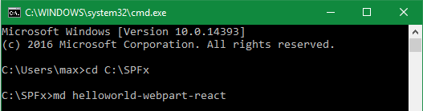

4. Type **cd helloworld-webpart-react** and press **Enter**.
	
	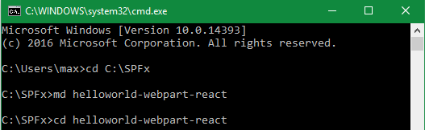

### Run the Yeoman SharePoint Generator ###

1. Type **yo @microsoft/sharepoint** and press **Enter**.
	
	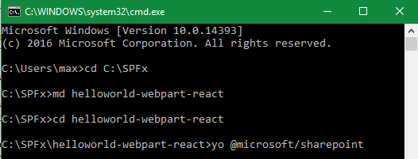

2. When prompted:

	1.	Accept the default **helloworld-webpart-react** as your solution name and press **Enter**.
	2.	Select **Use the current folder** for where to place the files and press **Enter**.

3. The next set of prompts asks for specific information about your web part:

	1.	Select **React** as the framework you would like to use and press **Enter**.
	2.	Enter **HelloWorld React** as your web part name and press **Enter**.
	3.	Enter **HelloWorld React description** as your web part description and press **Enter**.
	
	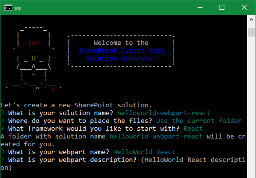

	>**Note:** At this point, Yeoman will install the required dependencies and scaffold the solution files along with the HelloWorld web part. This might take a few minutes.
	>When the scaffold is complete, you should see the following message indicating success.
	>
	>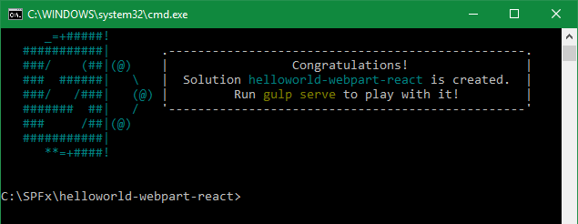

### Preview your web part ###

1. Make sure you are still in the **helloworld-webpart-react** directory.  
2. If you haven't installed and trusted a developer certificate, type **gulp trust-dev-cert** and press **Enter**.
	
	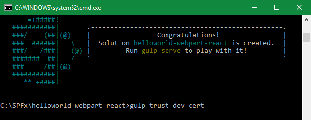

	> **Note:** The client-side toolchain uses HTTPS endpoint by default. However, since a default certificate is not configured for the local dev environment, your browser will report a certificate error. The command above installs and trusts a developer certificate used by HTTPS endpoint.
	> 
	> You only need to do this once per machine, not once per project. If you have done this in another project, please ignore this step.

2. Type **gulp serve** and press **Enter**.
	
	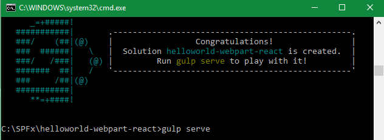

	> **Note:** This command executes a series of gulp tasks to create a local, Node-based HTTPS server on 'localhost:4321' and launches your default browser to preview web parts in your local dev environment.
	> 
	> Mozilla Firefox doesn't trust self-signed certificate. If you're using Mozilla Firefox, you will need to choose **Advanced** and add an exception to proceed to the website.
	>  
	>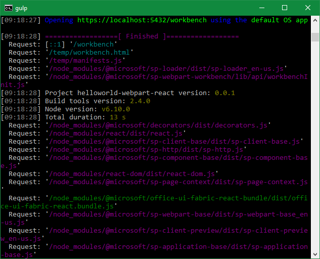

3. Switch to your default browser and make sure the **workbench.html** page has opened.

	

4. To add the **HelloWorld React** web part, choose the **plus** button.

	>**Note:** The plus button opens the toolbox where you can see a list of web parts available for you to add. The list includes the **HelloWorld React** web part as well other web parts available in your local development environment.

5. Choose **HelloWorld React** to add the web part to the page.

	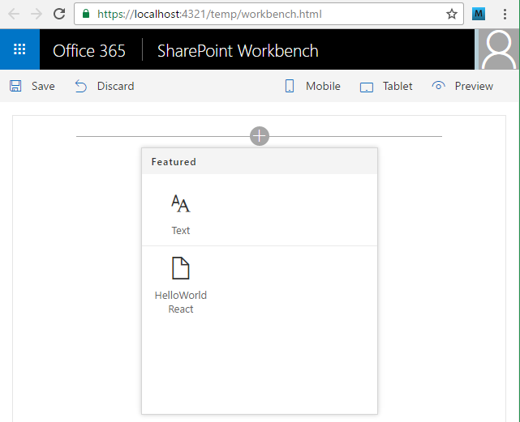

Congratulations! You have just added your client-side web part to a client-side page.

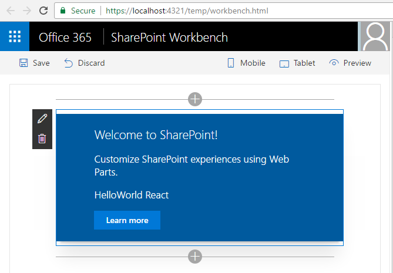

### Modify the web part's description property ###

1. Choose the pencil icon on the top left side of the web part to reveal the web part property pane.

	>**Note:** The property pane is where you access properties to customize your web part. The property pane is client-side driven and provides a consistent design across SharePoint.

2. Modify the text in the **Description** text box to **Client-side web parts are awesome!**

	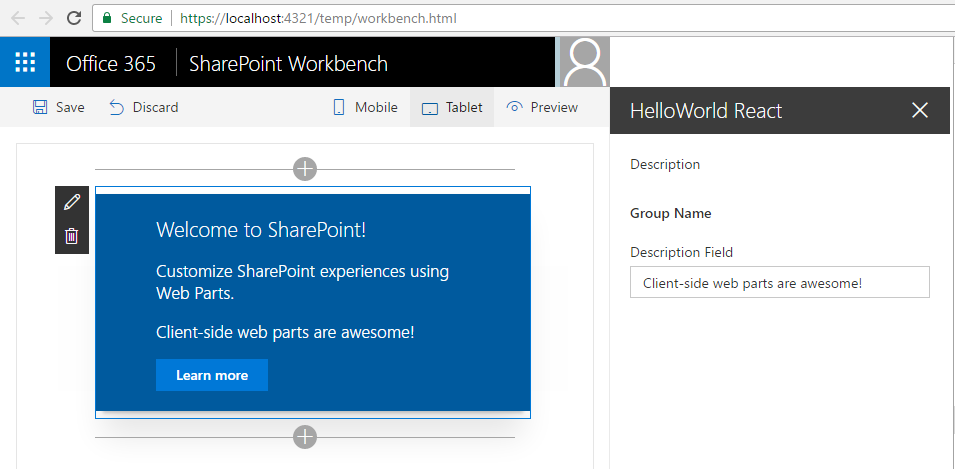

3. Notice how the text in the web part also changes as you type.
	
	>**Note:** One of the new capabilities available to the property pane is to configure its update behavior, which can be set to reactive or non-reactive. By default the update behavior is **reactive** and enables you to see the changes as you edit the properties. The changes are saved instantly as when the behavior is reactive. This is the behavior you observed in this exercise.

Congratulations! You have just modified your web part property.

