## SPFx Utilities ##

This section showcases some of the SharePoint Framework developer features, utilities, and best practices.

### Status Renderers ###
SharePoint Framework provides status renderers to use when the web part is loading information from SharePoint or to display errors if the web part runs into issues that could prevent it from working properly.

**Loading indicator**
- Used to display the loading indicator. Useful when you are initializing or loading any content in your web part.

**Error indicator**
- Used to display error messages. 


1. Open a **Command Prompt** window.
2. Change to the **helloworld-webpart** directory created in [Getting Started with the SharePoint Framework (SPFx)](../Module-1/Lab.md).
3. Open the **HelloWorld** web part project in Visual Studio Code, or your preferred IDE.

	> **Note:** If you are using Visual Studio Code, type **code .** and press **Enter**.
	> 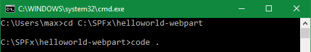

4. Open the **HelloWorldWebPart.ts** file.
5. Replace the **render** method with the following code.

	````
	public render(): void {
	  this.context.statusRenderer.displayLoadingIndicator(this.domElement, "message");
	  setTimeout(() => {
	    this.context.statusRenderer.clearLoadingIndicator(this.domElement);
	    try {
	        throw new Error("Error message");
	    } catch(err) {
	      this.context.statusRenderer.renderError(this.domElement, err);
	      setTimeout(() => {
	        this.context.statusRenderer.clearError(this.domElement);
	        this.domElement.innerHTML = `
	          <div class="${styles.helloWorld}">
	            <div class="${styles.container}">
	              <div class="ms-Grid-row ms-bgColor-themeDark ms-fontColor-white ${styles.row}">
	                <div class="ms-Grid-col ms-u-lg10 ms-u-xl8 ms-u-xlPush2 ms-u-lgPush1">
	                  <span class="ms-font-xl ms-fontColor-white">Welcome to SharePoint!</span>
	                  <p class="ms-font-l ms-fontColor-white">Customize SharePoint experiences using Web Parts.</p>
	                  <p class="ms-font-l ms-fontColor-white">${escape(this.properties.description)}</p>
	                  <a href="https://aka.ms/spfx" class="${styles.button}">
	                    <span class="${styles.label}">Learn more</span>
	                  </a>
	                </div>
	              </div>
	            </div>
	          </div>`;
	      }, 2000);
	    }
	  }, 2000);
	}
	````
	
	> **Notes:** 
	These JavaScript methods are invoked in the code above.  Here's what they do:
	>
	>To display the loading indicator call **displayLoadingIndicator**.  
	> ````
	> this.context.statusRenderer.displayLoadingIndicator(this.domElement, "message");
	> ````
	To clear the loading indicator when your operation is complete, call **clearLoadingIndicator**.
	> ````
	> this.context.statusRenderer.clearLoadingIndicator(this.domElement);
	> ````
	To throw an error just call **new Error()** with an error message.
	> ````
	> throw new Error("Error message");
	> ````
	To render the error call **renderError**.
	> ````
	> this.context.statusRenderer.renderError(this.domElement, err);
	> ````
	To clear the error call **clearError**
	> ````
	> this.context.statusRenderer.clearError(this.domElement);
	> ````

6. Save the **HelloWorldWebPart.ts** file and preview your web part in the workbench page hosted in SharePoint.

	> **Note:** You will see the web part display the following statuses by refreshing the page containing the web part. You could also preview the web part in the modern page, classic page, or local workbench. 
	> 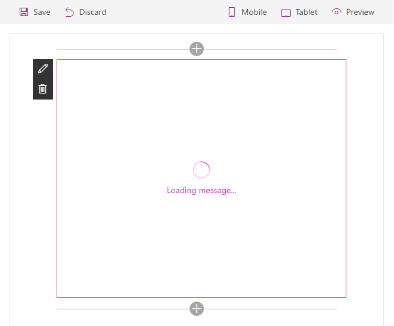
	> 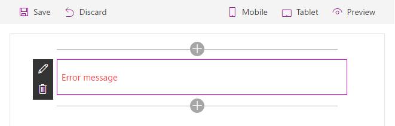
	> 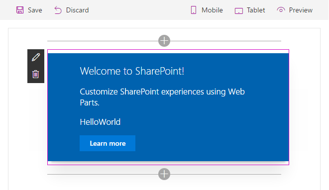

### Lodash Utility Library ###

[Lodash](https://lodash.com/) is a great JavaScript utility library that you can use to perform operations on various objects like arrays, numbers, strings etc., SharePoint Framework includes the  [`lodash` utility library](https://www.npmjs.com/package/@microsoft/sp-lodash-subset) for use with SharePoint Framework out-of-the-box so you do not need to install it separately. To improve run-time performance, it only includes a subset of the most essential lodash functions.

1. Open **HelloWorldWebPart.ts** file.
2. Change the import statement `import { escape } from '@microsoft/sp-lodash-subset';` to the following code to import the **findIndex** function from the **lodash** library:
		
	````
	import { escape, findIndex } from '@microsoft/sp-lodash-subset';
	````

	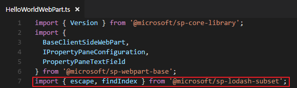

	> **Note:** lodash function **escape** is already used in the file. We will demonstrate another lodash function **findIndex**.

3. Define the following interface models above the **HelloWorldWebPart** class.
	
	````
	export interface ISPItem {
	    Title: string;
	    Id: string;
	}
	````
	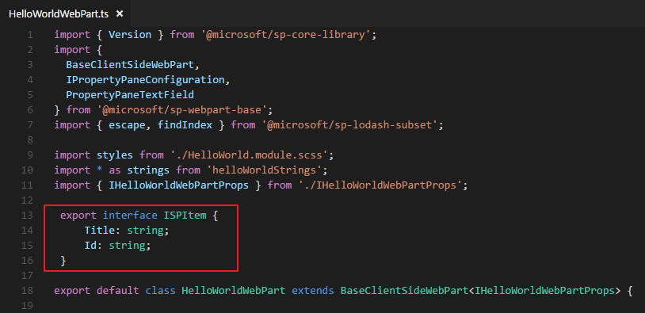

4. Add the following code in the **HelloWorldWebPart** class.
	
	````
	private _spItems: ISPItem[] = [
	    { Title:'Mock Title 1', Id: '1'},
	    { Title:'Mock Title 2', Id: '2'},
	    { Title:'Mock Title 3', Id: '3'},
	    { Title:'Mock Title 4', Id: '4'},
	    { Title:'Mock Title 5', Id: '5'}];
	````
	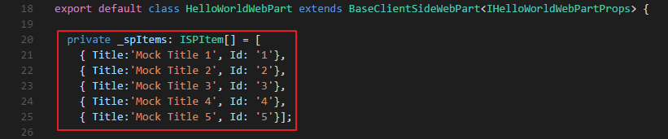

5. Add the following code in the `render` method.

	````
	const index : number = findIndex(
      this._spItems,
      (item: ISPItem) => item.Title === 'Mock Title 3');
	````
	
	````
	<p class="ms-font-l ms-fontColor-white">The index of "Mock Title 3" is: ${index}</p>
	````
	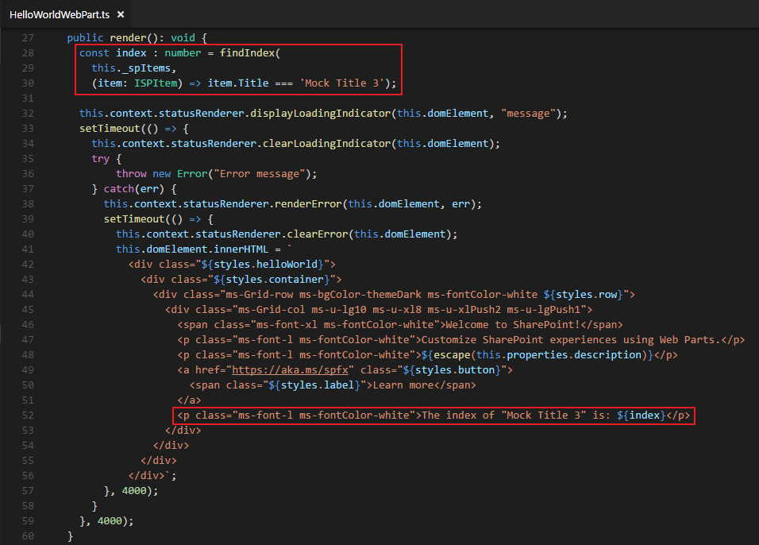

6. Save the **HelloWorldWebPart.ts** file and preview your web part in the workbench in SharePoint.
	
	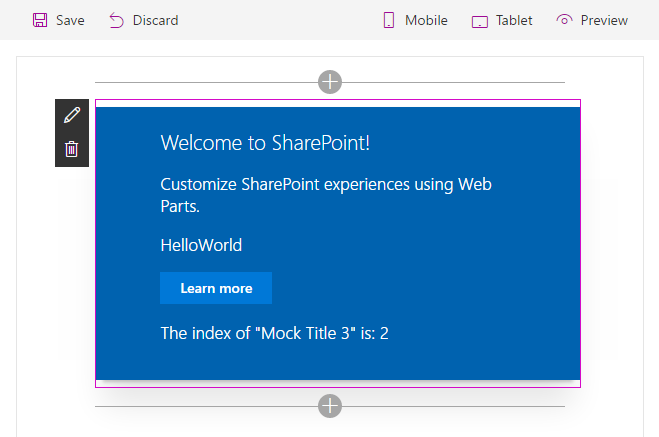

### Page Display Modes ###

SharePoint pages have display modes which indicate in which mode that page and/or its contents (e.g. text and web parts) are displayed. In the classic server-side SharePoint page, the web page and the web part can be in different modes.  For example, the web page can be in edit mode while the web part is not in edit mode.  In the modern client-side SharePoint page, both the page and/or its contents are in the same mode.

1. Open the **HelloWorldWebPart.ts** file.
2. Change the import statement `import { Version } from '@microsoft/sp-core-library';` to the following code to import the **DisplayMode** library:

	````
	import { Version, DisplayMode } from '@microsoft/sp-core-library';
	````

3. Add the following code in the `render` method.

	````
	const pageMode : string = this.displayMode === DisplayMode.Edit ? 'You are in edit mode' : 'You are in read mode';
	````
	
	````
	<p class="ms-font-l ms-fontColor-white">${pageMode}</p>
	````

	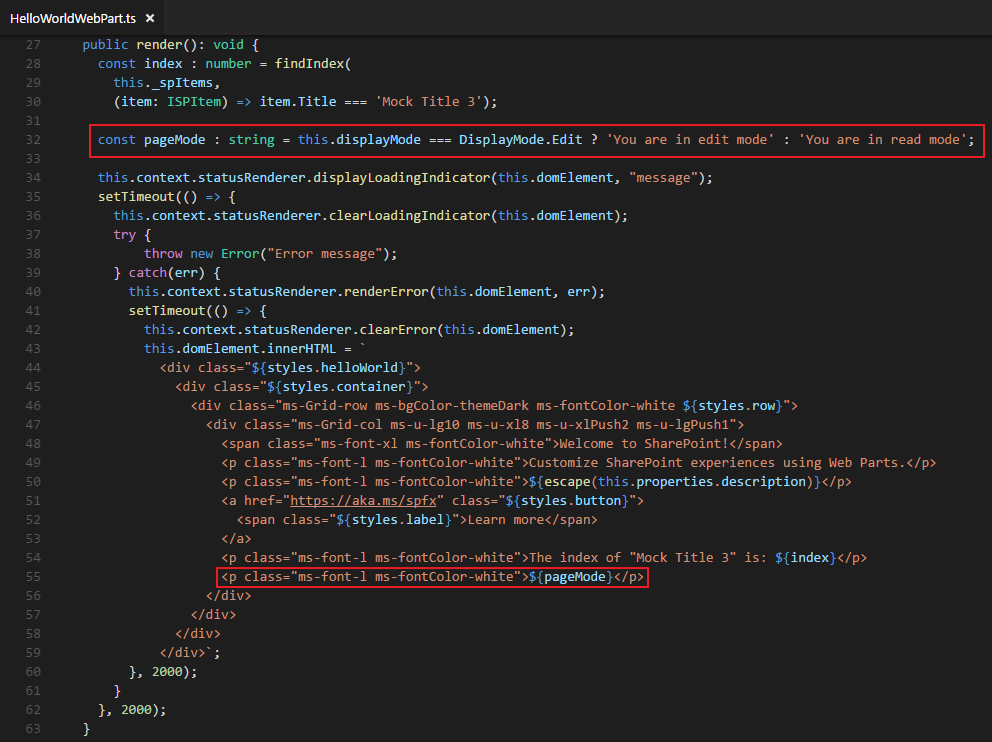

4. Save the **HelloWorldWebPart.ts** file.
5. View the web part in the modern page when the page is not in Edit mode.
	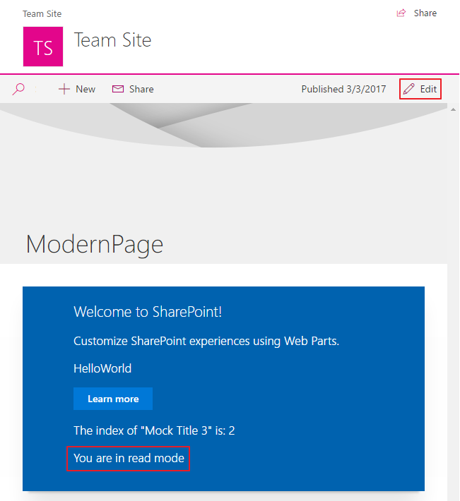 
6. View the web part in the modern page when the page is in Edit mode.	
	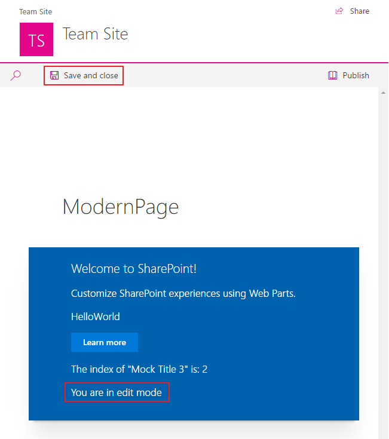
7. View the web part in the classic page when the page is not in Edit mode.
	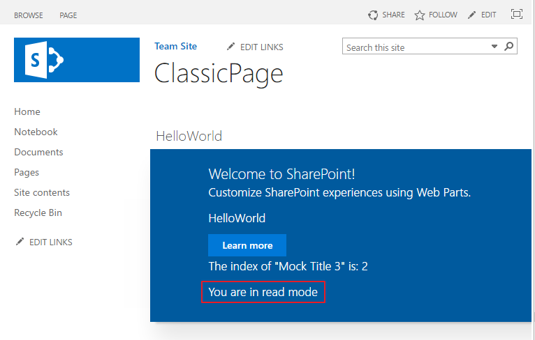 
8. View the web part in the classic page when the page is in Edit mode and the web part is not in Edit mode.	
	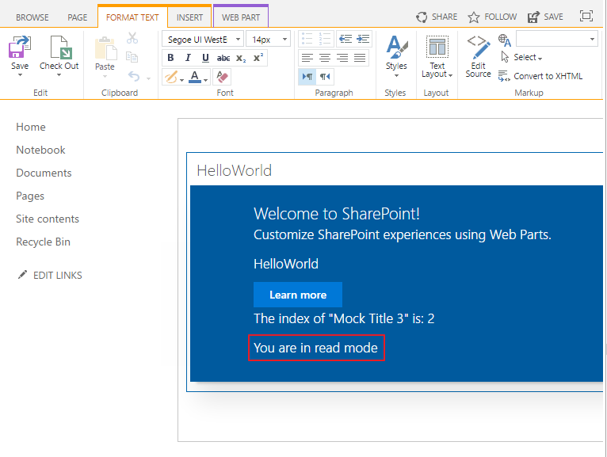
9. View the web part in the classic page when the page is in Edit mode and the web part is in Edit mode.	
	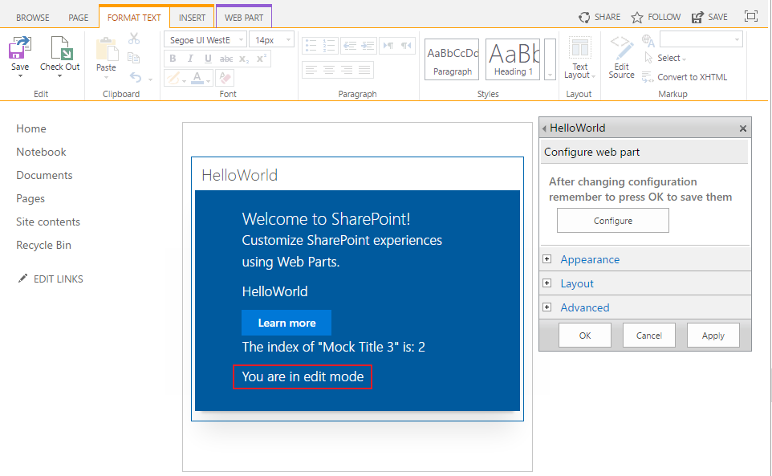	

### Page context ###

When the SharePoint workbench is hosted locally, you do not have the SharePoint page context. However, you can still test your web part in many different ways. For example, you can build the web part's UX and use mock data to simulate SharePoint interaction when you don't have the SharePoint context.

However, when the workbench is hosted in SharePoint, you get access to the page context which provides various key properties, such as:

- Web title
- Web absolute URL
- Web server-relative URL
- User login name

1. Open the **HelloWorldWebPart.ts** file.
2. Add the following code in the `render` method.

	````
	<p class='ms-font-l ms-fontColor-white'>Loading from ${this.context.pageContext.web.title}</p>
	````
	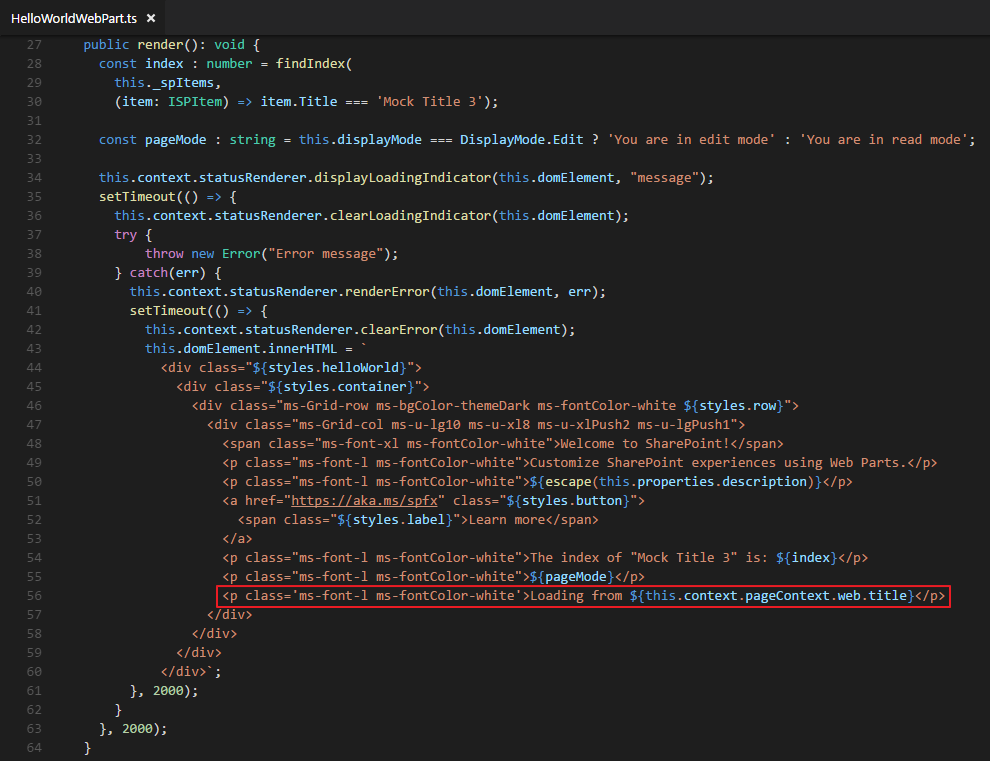

3. Save the **HelloWorldWebPart.ts** file and preview your web part running in the local workbench to see the page context.

	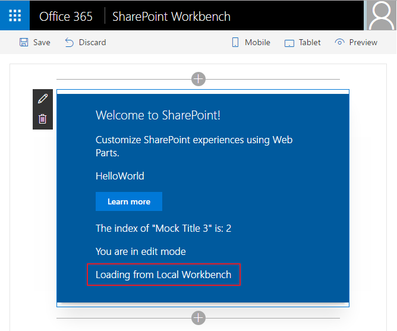

3. Preview your web part in the workbench in SharePoint, a modern page, or a classic page to see the page context.

	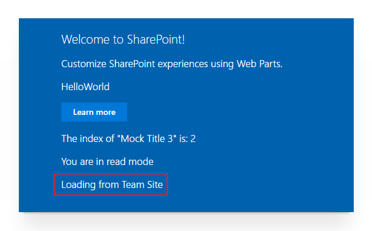

### Environment Type ###

The SharePoint workbench gives you the flexibility to test web parts in your local environment and from a SharePoint site. The EnvironmentType module is used to determine which environment your web part is running in.

1. Open the **HelloWorldWebPart.ts** file.
2. Change the import statement `import { Version, DisplayMode } from '@microsoft/sp-core-library';` to the following code to import the **Environment** and **EnvironmentType** library:

	````
	import { Version, DisplayMode, Environment, EnvironmentType } from '@microsoft/sp-core-library';
	````
	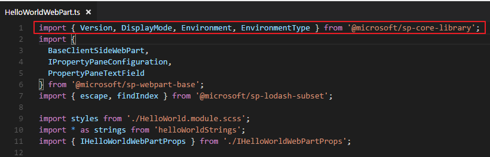

3. Add the following code in the `render` method.

	````
	const environmentType : string = Environment.type === EnvironmentType.Local ? 'You are in local environment' : 'You are in sharepoint environment';
	````
	
	````
	<p class="ms-font-l ms-fontColor-white">${environmentType}</p>
	````
	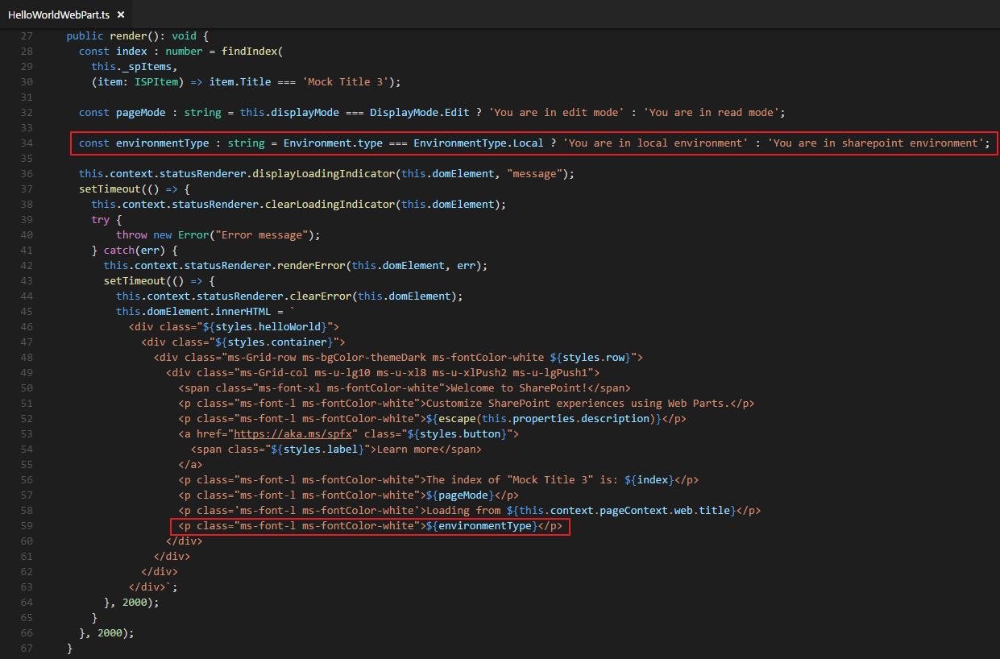

4. Save the **HelloWorldWebPart.ts** file and preview your web part running in the local workbench to see the environment you are running in.
	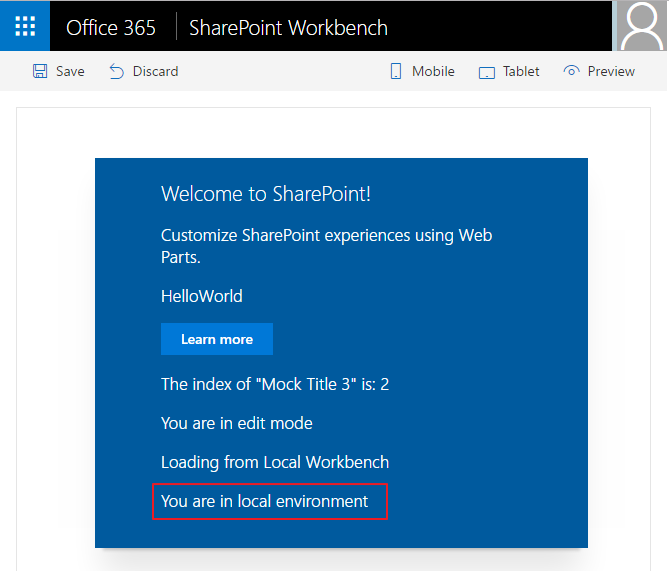

5. Preview your web part running in the workbench in SharePoint to see the environment you are running in.
	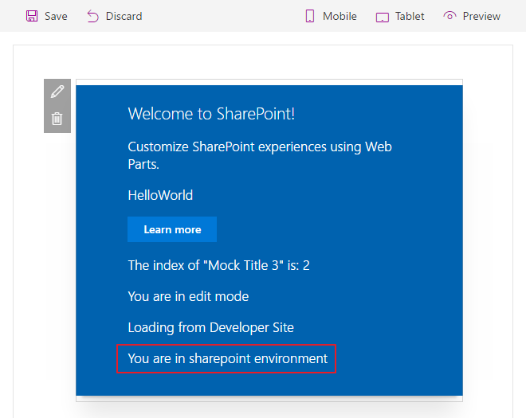

### Logging API ###

Logging is a very convenient and easy way to keep track of events happening in the web part, instead of having breakpoints, or alerts in JavaScript. The SharePoint Framework has a built-in logging mechanism.

1. Open the **HelloWorldWebPart.ts** file.
2. Change the import statement `import { Version, DisplayMode, Environment, EnvironmentType } from '@microsoft/sp-core-library';` to the following code to import the **Log** library:
	
	````
	import { Version, DisplayMode, Environment, EnvironmentType, Log } from '@microsoft/sp-core-library';
	````

	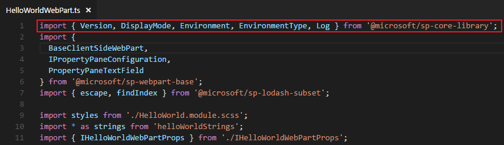	

	> **Note:** The Log class contains four static methods for logging:
	> 
	> - **info** : log information
	> - **warn** : log warnings 
	> - **error** : log errors
	> - **verbose** : log everything
	> 
	> In the SharePoint Framework all logging is done to the JavaScript console and you can see the logging using the developer tools in a web browser.
	> 
	> All static methods have the same signature, except the error method - they take three arguments:
	>
	> - **source**: the source of the logging information (max 20 characters), such as the method or the class name
	> - **message**: the actual message to log (max 100 characters)
	> - **scope**: an optional service scope
	> 
	> The **error** method takes an **Error** object instead of the **message** string, otherwise they are the same. 

3. Add the following code in the `render` method.

	````
	Log.info('HelloWorld', 'message', this.context.serviceScope);
    Log.warn('HelloWorld', 'WARNING message', this.context.serviceScope);
    Log.error('HelloWorld', new Error('Error message'), this.context.serviceScope);
    Log.verbose('HelloWorld', 'VERBOSE message', this.context.serviceScope);
	````

	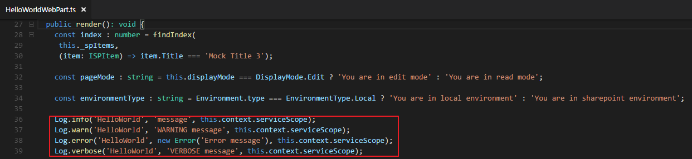

4. Save the **HelloWorldWebPart.ts** file and preview your web part in the local workbench.
5. Open the **Developer tools** and view the log information.

	> **Note**: If you are using **Chrome**, you can press **F12** and then choose the **Console** tab to view the log information.
	
	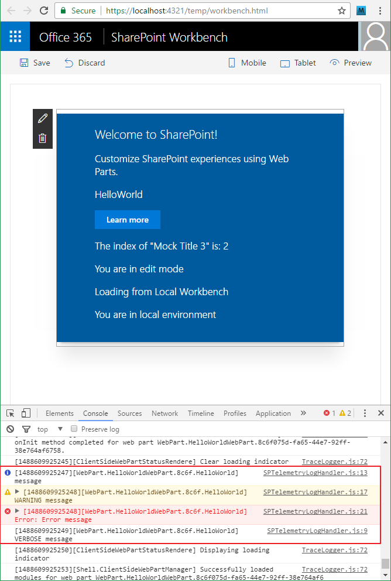
