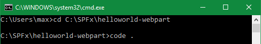

# Working with SharePoint Content #
In this lab, you will connect your web part to SharePoint to access functionality and data in SharePoint and provide a more integrated experience for end users.

## Prerequisites ##
Make sure you have completed the procedures in the following sections of [Getting Started with the SharePoint Framework (SPFx)](../Module-1/Lab.md) module: 
- [Setup development environment](../Module-1/Lab.md#setup-development-environment)
- [Setup Office 365 tenant](../Module-1/Lab.md#setup-office-365-tenant)

## Exercise 1: Using mocks to simulate SharePoint data ##
In this exercise you will enhance the **HelloWorldReact** web part created in [Getting Started with the SharePoint Framework (SPFx)](../Module-1/Lab.md) to return mock data and render it.

1. Open a **Command Prompt** window.
2. Change to the **helloworld-webpart-react** directory created in [Getting Started with the SharePoint Framework (SPFx)](../Module-1/Lab.md).
3. Open the **HelloWorldReact** web part project in Visual Studio Code, or your preferred IDE.

	>**Note:** To open in Visual Studio code enter **code .** on the command line.

	

4. Create a new file inside the **src\webparts\helloWorldReact** folder named **ISPList.ts**.

	>**Note:** This file is the interface to the SharePoint list used in this exercise.

	

5. Open the **ISPList.ts** file.
6. Copy the following code into **ISPList.ts**.

	````
	export interface ISPList {
	    Title: string;
	    Id: string;
	}
	````

7. Create a new file inside the **src\webparts\helloWorldReact** folder named **MockHttpClient.ts**.

	>**Note:** This file is used to return mock data to simulate list items returned from a query to a Shareoint list.

	

8. Open the **MockHttpClient.ts** file.
9. Copy the following code into **MockHttpClient.ts**.

	````
	import { ISPList } from './ISPList';

	export default class MockHttpClient {
	
	    private static _items: ISPList[] = [
	      { Title: 'Mock List 1', Id: '1' },
	      { Title: 'Mock List 2', Id: '2' },
	      { Title: 'Mock List 3', Id: '3' },
	      { Title: 'Mock List 4', Id: '4' },
	      { Title: 'Mock List 5', Id: '5' }
	    ];
	
	    public static get(restUrl: string, options?: any): Promise<ISPList[]> {
	    return new Promise<ISPList[]>((resolve) => {
	            resolve(MockHttpClient._items);
	        });
	    }
	}
	````

10. Open the **components/IHelloWorldReactProps.ts** file.
11. Add the following code to import the **ISPList** library from `.././ISPList`.

	````
	import { ISPList } from '.././ISPList';
	````

12. Add the following code in the **IHelloWorldReactProps** interface.

	````
	lists: ISPList[];
	````
	
	
 
13. Open the **HelloWorldReactWebPart.ts** file.
14. Add the following code to import the following libraries.

	````
	import MockHttpClient from './MockHttpClient';
	import { ISPList } from './ISPList';
	````
 
	

15. Add the following method in **HelloWorldReactWebPart** class.

	>**Note:** This method returns the mock data.

	````
	private _getMockListData(): Promise<ISPList[]> {
		return MockHttpClient.get(this.context.pageContext.web.absoluteUrl)
		    .then((data: ISPList[]) => {
		         return data;
		     });
	}
	````

	

16. Replace the **render** method with the following code.

	>**Note:** This code enhances the render method so it invokes the **_getMockListData** method and renders the mock data.

	````
	public render(): void {
	    this._getMockListData().then(lists => {
	      const element: React.ReactElement<IHelloWorldReactProps> = React.createElement(HelloWorldReact, {
	        description: this.properties.description,
	        lists: lists
	      });
	
	      ReactDom.render(element, this.domElement);
	    });
	}
	````

17. Open the **components\HelloWorldReact.module.scss** file.
18. Add the following styles after the **.button** style.

	````
	.list {
	    color: #333333;
	    font-family: 'Segoe UI Regular WestEuropean', 'Segoe UI', Tahoma, Arial, sans-serif;
	    font-size: 14px;
	    font-weight: normal;
	    box-sizing: border-box;
	    margin: 0 0;
	    padding: 10px 0 100px 0;
	    line-height: 50px;
	    list-style-type: none;
	}
	
	.item {
	    color: #333333;
	    vertical-align: center;
	    font-family: 'Segoe UI Regular WestEuropean', 'Segoe UI', Tahoma, Arial, sans-serif;
	    font-size: 14px;
	    font-weight: normal;
	    box-sizing: border-box;
	    margin: 0;
	    padding: 0;
	    box-shadow: none;
	    *zoom: 1;
	    padding: 0 15px;
	    position: relative;
	    box-shadow: 0 2px 4px 0 rgba(0, 0, 0, 0.2), 0 25px 50px 0 rgba(0, 0, 0, 0.1);
	}
	````

19. Open the **components\HelloWorldReact.tsx** file.
20. Add the following code in the **render** method.

	>**Note:** This markup is used to render the mock data in the the HelloWorldReact component.

	````
	<ul className={styles.list}>
	    {this.props.lists.map((list) =>
	      <li key={list.Id} className={styles.item}>
	        Id: {list.Id}, Title: {list.Title}
	      </li>
	      )}
	</ul>
	````
	
	

21. Save all files.
22. Preview the web part in your **local workbench** and notice the mock data is displayed.

	> **Note**: If you didn't install and trust a developer certificate on your machine, please install it on your machine.
	> 1. Open a **Command Prompt** window and change to the **helloworld-webpart-react** directory.
	> 2. Type **gulp trust-dev-cert** and press **Enter**.
	
	

## Exercise 2: Using HttpClient to talk to SharePoint ##
In this exercise you will continue to enhance the **HelloWorldReact** web part created in [Getting Started with the SharePoint Framework (SPFx)](../Module-1/Lab.md).  You will modify the web part to invoke the SharePoint REST API to return a list of the lists in the SharePoint site where the web part is executing.

1. Open the **HelloWorldReact** web part project you modified in **Exercise 1** in Visual Studio Code, or your preferred IDE.

	>**Note:** To open in Visual Studio code enter **code .** on the command line.

	

2. Open the **HelloWorldReactWebPart.ts** file.
3. Add the following code to import the **Environment** and **EnvironmentType** library form `@microsoft/sp-core-library`.

	````
	import { Environment, EnvironmentType } from '@microsoft/sp-core-library';
	````

	>**Note:** This library allows you to determine if the web part is running in the local workbench or on a SharePoint web site.

4. Add the following code to import the **SPHttpClient** library from `@microsoft/sp-http`.

	````
	import { SPHttpClient } from '@microsoft/sp-http';
	````

	>**Note:** This library is used to perform REST calls against SharePoint. It includes standard predefined ISPHttpClientConfigurations object for use with the methods of SPHttpClient class.

5. Add the following code in **HelloWorldReactWebPart** class.

	>**Note:** The **_getSharePointListData** method invokes the SharePoint REST API to return the SharePoint lists in the SharePoint site where the web part executes.  The **_getListData** method determines what environment the web part is running in.  It returns mock data when running in the local environment or it returns data from the SharePoint REST API when not running in the local environment.

	````
	private _getSharePointListData(): Promise<ISPList[]> {
     const url: string = this.context.pageContext.web.absoluteUrl + `/_api/web/lists?$filter=Hidden eq false`;
     return this.context.spHttpClient.get(url, SPHttpClient.configurations.v1)
       .then(response => {
         return response.json();
       })
       .then(json => {
         return json.value;
       }) as Promise<ISPList[]>;
	}

	private _getListData(): Promise<ISPList[]> {
	   if(Environment.type === EnvironmentType.Local) {
	      return this._getMockListData();
	   }
	   else {
	     return this._getSharePointListData();
	   }
	}
	````

	

6. Replace the **_getMockListData** method with the **_getListData** method in the **render** method.

	

7. Save all files.
8. Preview the web part in the **SharePoint workbench on your Office 365 developer site** and notice the data of the SharePoint lists is displayed.

	> **Note**: If you didn't install and trust a developer certificate on your machine, please install it on your machine.
	> 1. Open a **Command Prompt** window and change to the **helloworld-webpart-react** directory.
	> 2. Type **gulp trust-dev-cert** and press **Enter**.
	
	> **Notes**: 
	> If you followed the instructions in the [Getting Started with the SharePoint Framework (SPFx)](../Module-1/Lab.md) module, the SharePoint workbench on your Office 365 developer site is located at **https://your-sharepoint-site/_layouts/workbench.aspx**.  Replace the your-sharepoint-site placeholder with the name of your Office 365 Developer site.
	> 
	> Delete all of the existing web parts in SharePoint workbench and then add the **HelloWorldReact** web part to preview it.

	


## Exercise 3: Basic CRUD operations with no framework  ##
In this exercise you will enhance the **HelloWorld** web part created in [Getting Started with the SharePoint Framework (SPFx)](../Module-1/Lab.md).  You will modify the web part so it performs create, read, update, and delete (CRUD) operations on a SharePoint list.

### Prepare a SharePoint list ###

1. Go to the **Site Contents** page on your Office 365 Developer Site.
2. Choose the **New** link on the top navigation bar, and then choose **List**.
	
	

3. In the name textbox enter **Test**, then choose **Create**.

	

	> **Note**: The list name will be used in the following section. 

### Implement the CRUD operations ###

1. Open a **Command Prompt** window.
2. Change to the **helloworld-webpart** directory created in [Getting Started with the SharePoint Framework (SPFx)](../Module-1/Lab.md).
3. Open the **HelloWorld** web part project in Visual Studio Code, or your preferred IDE.
4. Open the **HelloWorldWebPart.ts** file.
8. Add the following code to import types **SPHttpClient** and **SPHttpClientResponse** from `@microsoft/sp-http`.

	>**Note:** This library is used to perform REST calls against SharePoint. It includes standard predefined ISPHttpClientConfigurations object for use with the methods of SPHttpClient class.
	
	````
	import { SPHttpClient, SPHttpClientResponse } from '@microsoft/sp-http';
	````

9. Define the following interface models just above the **HelloWorldWebPart** class. 

	````
	export interface IListItem {
	  Id: number;
	  Title: string;
	}
	````

	

10. Add the following code in **HelloWorldWebPart** class.

	>**Note:** Notice the name of the list you created is assigned to the _listName variable.
	
	````
	private _listName: string = "Test";
	private _listItemEntityTypeFullName: string;
	````

	

11. Add the following code in **HelloWorldWebPart** class.

	>**Note:** This method invokes the **getListItems** method then creates the HTML to render the list items and the buttons associated with each of them. Then, it wires up the event handlers for the buttons.
	
	````
	protected generateListItemsHtml(): void{
	  const rootContainer: Element = this.domElement.querySelector("#tbodyItems");
	
	  this.getListItems()
	  .then((data: IListItem[]) => {
	    const count: number = data.length;
	    document.getElementById("spanItemLength").innerText = count.toString();
	    document.getElementById("theader").style.display = (count === 0 ? "none" : "");
	
	    for (let i:number = 0; i < count; i++){
	      const Id: number = data[i].Id,
	          Title: string = data[i].Title;
	      rootContainer.insertAdjacentHTML('beforeend', `
	        <tr data-id="${Id}">
	          <td><input class="ms-TextField-field" value="${Title}"></input></td>
	          <td>
	            <button class="${styles.button}">
	              <label class="${styles.label}">Update</label>
	            </button>
	          </td>
	          <td>
	            <button class="${styles.button}">
	              <label class="${styles.label}">Delete</label>
	            </button>
	          </td>
	        </tr>
	      `);
	
	      const buttons = rootContainer.querySelectorAll(`tr[data-id='${Id}'] button`);
	
	      buttons[0].addEventListener("click", (evt: Event): void => {
	        const trNode: Element = this._getTrAncestor(evt.srcElement);
	        this.saveListItem(trNode, trNode.attributes["data-id"].value);
	        evt.preventDefault();
	      });
	
	      buttons[1].addEventListener("click", (evt: Event) : void => {
	        const trNode: Element = this._getTrAncestor(evt.srcElement);
	        this.removeListItem(trNode, trNode.attributes["data-id"].value);
	        evt.preventDefault();
	      });
	    }
	  });
	}
	````

	>**Note:** This method invokes the SharePoint REST API and returns the name of the list specified by the **_listName** variable.
	
	````
	private _getListItemEntityTypeFullName():Promise<string> {
	  if (this._listItemEntityTypeFullName){
	    return Promise.resolve(this._listItemEntityTypeFullName);
	  }
	
	  return this.context.spHttpClient.get(this.context.pageContext["web"]["absoluteUrl"]
	    + `/_api/web/lists/GetByTitle('${this._listName}')`, SPHttpClient.configurations.v1)
	    .then((response: SPHttpClientResponse) => {
	      return response.json();
	    })
	    .then((value) => {
	      this._listItemEntityTypeFullName = value["ListItemEntityTypeFullName"];
	      return this._listItemEntityTypeFullName;
	    });
	}
	````

	>**Note:** This method fires when the Add New Item button is clicked.  It adds the controls to accommodate a new list item to the page and wires up the event handlers for the buttons.
	
	````
	private addNewListItem(): void {
	  const rootContainer: Element = this.domElement.querySelector("#tbodyItems");
	  rootContainer["insertAdjacentHTML"]('beforeend',
	  `<tr data-id="0">
	      <td>
	        <input class='ms-TextField-field' value=""></input>
	      </td>
	      <td>
	        <button class="${styles.button}">
	          <label class="${styles.label}">Add</label>
	        </button>
	      </td>
	      <td>
	        <button class="${styles.button}">
	          <label class="${styles.label}">Cancel</label>
	        </button>
	      </td>
	  </tr>`);
	
	  const buttons = rootContainer.querySelectorAll('tr')[rootContainer.querySelectorAll('tr').length - 1].querySelectorAll('button');
	
	  buttons[0].addEventListener("click", (evt: Event): void => {
	    const trNode: Element = this._getTrAncestor(evt.srcElement);
	    this.saveListItem(trNode, trNode.attributes["data-id"].value);
	    evt.preventDefault();
	  });
	
	  buttons[1].addEventListener("click", (evt: Event) : void => {
	    const trNode: Element = this._getTrAncestor(evt.srcElement);
	    this.removeListItem(trNode, trNode.attributes["data-id"].value);
	    evt.preventDefault();
	  });
	}
	````

	>**Note:** This method invokes the SharePoint REST API and returns the list items from the list specified by the **_listName** variable.
	
	````
	private getListItems(): Promise<IListItem[]> {
	  return this.context.spHttpClient.get(this.context.pageContext["web"]["absoluteUrl"]
	  + `/_api/web/lists/GetByTitle('${this._listName}')/items?$select=Id,Title`, SPHttpClient.configurations.v1)
	  .then((response: SPHttpClientResponse): Promise<any> => {
	    return response.json();
	  })
	  .then((data: any) : IListItem[]  =>{
	    this._showSuccess(`Successfully loaded ${data.value.length} items`);
	    return data.value;
	  }, (error: any): void => {
	    this._showError(`Loading all items failed with error: ${error}`);
	  }) as Promise<IListItem[]>;
	}
	````

	>**Note:** This method invokes the SharePoint REST API and creates new items or updates existing list items in the list specified by the **_listName** variable.
	
	````
	private saveListItem(ContainerNode: Element, Id: string): void {
	  this._clearMessage();
	
	  const title = ContainerNode.querySelector("input").value;
	
	  if(title.trim().length === 0) {
	    this._showError('Title is required');
	    return;
	  }
	
	  this._getListItemEntityTypeFullName()
	  .then((listItemEntityTypeFullName: string) => {
	    const reqJSON: any = {
	      "@odata.type": listItemEntityTypeFullName,
	      "Title": title
	    };
	
	    if(Id === "0") {
	      //create a new item
	      this.context.spHttpClient.post(
	          this.context.pageContext["web"]["absoluteUrl"] +
	          `/_api/web/lists/GetByTitle('${this._listName}')/items`, SPHttpClient.configurations.v1,
	          {
	            body: JSON.stringify(reqJSON),
	            headers: {
	              "accept": "application/json",
	              "content-type": "application/json"
	            }
	      })
	      .then((response: SPHttpClientResponse): Promise<IListItem> => {
	        return response.json();
	      })
	      .then((item: IListItem): void => {
	        ContainerNode.querySelectorAll("button")[0].textContent = "Update";
	        ContainerNode.querySelectorAll("button")[0].parentElement.parentElement.setAttribute("data-id", item.Id.toString());
	        this._showSuccess(`Item '${item.Title}' (ID: ${item.Id}) successfully created`);
	        this._updateItemCount(1);
	      }, (error: any): void => {
	        this._showError('Error while creating the item: ${error}');
	      });
	    }
	    else {
	      //update a list item
	      this.context.spHttpClient.post(
	        this.context.pageContext["web"]["absoluteUrl"] +
	        `/_api/web/lists/GetByTitle('${this._listName}')/items(${Id})`, SPHttpClient.configurations.v1, 
	        {
	          body: JSON.stringify(reqJSON),
	          headers: {
	            "IF-MATCH": "*",
	            "X-HTTP-Method":"MERGE",
	            "accept": "application/json",
	            "content-type": "application/json"
	        }
	      })
	      .then((response: SPHttpClientResponse): void => {
	        this._showSuccess(`Item with ID: ${Id} successfully updated`);
	      }, (error: any): void => {
	        this._showError(`Error updating item: + ${error}`);
	      });
	    }
	  });
	}
	````

	>**Note:** This method invokes the SharePoint REST API and deletes the list item from the list specified by the **_listName** variable.
	
	````
	private removeListItem (ContainerNode: Element, Id: string): void {
	  this._clearMessage();
	
	  if(Id === "0"){
	    ContainerNode.parentNode.removeChild(ContainerNode);
	  }
	  else{
	    this.context.spHttpClient.post(
	      this.context.pageContext["web"]["absoluteUrl"] +
	      `/_api/web/lists/GetByTitle('${this._listName}')/items(${Id})`, SPHttpClient.configurations.v1, 
	      {
	        headers: {
	          "IF-MATCH": "*",
	          "X-HTTP-Method":"DELETE",
	          "accept": "application/json",
	          "content-type": "application/json"
	        }
	    })
	    .then((response: SPHttpClientResponse): void => {
	      ContainerNode.parentNode.removeChild(ContainerNode);
	      this._showSuccess(`Item with ID: ${Id} successfully deleted`);
	      this._updateItemCount(-1);
	    }, (error: any): void => {
	      this._showError(`Error deleting item: ${error}`);
	    });
	  }
	}
	````

	>**Note:** Utility method used to update the list item count.
	
	````
	private _updateItemCount(increment: number){
	  const countElement = document.getElementById("spanItemLength");
	  const count: number = Number(countElement.innerText);
	  countElement.innerText = (count + increment).toString();
	}
	````

	>**Note:** Utility method used to get the closest table row ancestor of an element.
	
	````
	private _getTrAncestor(element: Element): Element{
	  while (element && element.tagName.toLowerCase() != "tr"){
	    element = element.parentElement;
	  }
	  return element;
	}
	````

	>**Note:** Utility method used to clear status messages in the web part.
	
	````
	private _clearMessage() {
	    this.domElement.querySelector("#message").innerHTML = "";
	}
	````

	>**Note:** Utility method used to display success status messages in the web part.
	
	````
	private _showSuccess(message: string) {
	    const elem: Element = this.domElement.querySelector("#message");
	    elem.className = "ms-fontColor-white";
	    elem.innerHTML = message;
	}
	````

	>**Note:** Utility method used to display error status messages in the web part.

	````
	private _showError(message: string) {
	    const elem: Element = this.domElement.querySelector("#message");
	    elem.className = "ms-fontColor-red";
	    elem.innerHTML = message;
	}
	````

12. Replace the **render** method with the following code to enhance the user interface to accommodate this sample scenario.

	````
	public render(): void {
	  this.domElement.innerHTML = `
	    <div class="${styles.helloWorld}">
	      <div class="${styles.container}">
	        <div class="ms-Grid-row ms-bgColor-themeDark ms-fontColor-white ${styles.row}">
	          <p class="ms-font-l">There are <span id="spanItemLength"></span> item(s) in <span id="spanItemName">${this._listName}</span> list</p>
	          <table>
	            <thead id="theader" style="display:none">
	              <tr>
	                <th class="ms-font-xl">Title</th>
	                <th />
	                <th />
	              </tr>
	            </thead>
	            <tbody id="tbodyItems">
	            </tbody>
	          </table>
	        </div>
	        <div class="ms-Grid-row ms-bgColor-themeDark ms-fontColor-white ${styles.row}">
	          <button class="${styles.button}">
	            <label class="${styles.label}">Add New Item</label>
	          </button>
	        </div>
	        <div class="ms-Grid-row ms-bgColor-themeDark ms-fontColor-white ${styles.row}">
	          <div class="ms-font-l" id="message"></div>
	        </div>
	      </div>
	    </div>`;
	
	  this.generateListItemsHtml();
	  this.domElement.getElementsByTagName("button")[0].addEventListener("click", () => {
	    this.addNewListItem();
	  });
	}
	````

13. Remove the unused code `import { escape } from '@microsoft/sp-lodash-subset';`.
14. Preview the web part in the **SharePoint workbench on your Office 365 developer site**.

	> **Note**: If you didn't install and trust a developer certificate on your machine, please install it on your machine.
	> 1. Open a **Command Prompt** window and change to the **helloworld-webpart** directory.
	> 2. Type **gulp trust-dev-cert** and press **Enter**.

	> **Notes**: 
	> If you followed the instructions in the [Getting Started with the SharePoint Framework (SPFx)](../Module-1/Lab.md) module, the SharePoint workbench on your Office 365 developer site is located at **https://TENANCY.sharepoint.com/_layouts/workbench.aspx**.  Replace the TENANCY placeholder with the name of your Office 365 Developer tenancy.
	> 
	> Delete all of the existing web parts in SharePoint workbench and then add the **HelloWorld** web part to preview it.
	
	

#### Test creating a list item ####

1. Choose **Add New Item**.
2. Enter **Item 1** as the title, then choose **Add**.

	

3. The message in the web part indicates **Item 1** is successfully created.

	

4. Verify the new item is created in the list view page. 

	


#### Test updating a list item ####

1. Choose **Add New Item**.
2. Enter **Item 2** as the title, then choose **Add**.

	

3. Verify the new item is created in the list view page. 
 
	

4. Enter **New Item 2** as the new title for **Item 2**, then choose **Update**.

	

5. The message in the web part indicates the list item was successfully updated.

	

6. Verify the item was updated in the list view page. 

	

#### Test reading all list items ####

1. Refresh the SharePoint workbench page.
2. All list items are loaded.

	

#### Test deleting a list item ####

1. Refresh the SharePoint workbench page.
2. Next to **Item 1**, choose the **Delete** button.

	
 
3. The message in the web part indicates the list item was successfully deleted.

	
 
4. Verify the item was deleted in the list view page. 

	


# Exercise 4 : Connect to SharePoint using the JavaScript Object Model (JSOM)

In the past, when building SharePoint customizations you might have used the SharePoint JavaScript Object Model (JSOM) to communicate with SharePoint. This is no longer the recommended path (see **Considerations** below), but there are still valid use cases such as code migration. This article demonstrates how to use SharePoint JSOM when building solutions on the SharePoint Framework.

> **Note:** Before following the steps in this article, be sure to [set up your SharePoint Framework development environment](../../set-up-your-development-environment.md).

## Create a New Project

From the console, create a new folder for your project:

```sh
md react-sharepointlists
```

Go to the project folder:

```sh
cd react-sharepointlists
```

In the project folder, run the SharePoint Framework Yeoman generator to scaffold a new SharePoint Framework project:

```sh
yo @microsoft/sharepoint
```

When prompted, enter the following values:

- **react-sharepointlists** as your solution name.
- Choose **Webpart** as the client-side component type to be created.
- **Use the current folder** for the location to place the files.
- **React** as the starting framework to build the web part.
- **SharePoint lists** as your web part name.
- **Shows names of lists in the current site** as your web part description.


Once the scaffolding completes, lock down the version of the project dependencies by running the following command:

```sh
npm shrinkwrap
```

Next, open your project folder in your code editor. This article uses Visual Studio Code in the steps and screenshots but you can use any editor you prefer.


To open the directory in Visual Studio Code, from the console type:
```sh
code .
```

## Referencing JSOM
In order to use SharePoint JSOM in your SharePoint Framework component, you must first reference it. In the past it was already available on the page for you to use. In the SharePoint Framework, it has to be explicitly loaded.

There are two ways to reference SharePoint JSOM in the SharePoint Framework: 
- **Declarative** - through configuration
- **Imperative** - through code

Each of these approaches have advantages and disadvantages and it's important for you to understand each of them.

## Reference JSOM Declaratively

When referencing JSOM declaratively, the first step is to register the SharePoint JSOM API as external scripts within your SharePoint Framework project. In your code editor, open the **./config/config.json** file and add the following to the **externals** section:

```json
{
  // ...
  "externals": {
    "sp-init": {
      "path": "https://contoso.sharepoint.com/_layouts/15/init.js",
      "globalName": "$_global_init"
    },
    "microsoft-ajax": {
      "path": "https://contoso.sharepoint.com/_layouts/15/MicrosoftAjax.js",
      "globalName": "Sys",
      "globalDependencies": [
        "sp-init"
      ]
    },
    "sp-runtime": {
      "path": "https://contoso.sharepoint.com/_layouts/15/SP.Runtime.js",
      "globalName": "SP",
      "globalDependencies": [
        "microsoft-ajax"
      ]
    },
    "sharepoint": {
      "path": "https://contoso.sharepoint.com/_layouts/15/SP.js",
      "globalName": "SP",
      "globalDependencies": [
        "sp-runtime"
      ]
    }
  }
  // ...
}
```

Each of the entries points to different script files that together allows you to use SharePoint JSOM in your SPFx component. All of these scripts are distributed as non-module scripts. This is why each registration entry requires a URL, (specified using the `path` property) and the name used by the script (provided in the `globalName` property). To ensure that these scripts load in the right order, the dependencies between these scripts are specified using the `globalDependencies` property.

Additional scripts may need to be added depending on the JSOM functionality you are using (e.g. sp.taxonomy.js).

### Install TypeScript Typings for SharePoint JSOM

The next step is to install and configure TypeScript typings for SharePoint JSOM. This allows you to benefit from TypeScript's type safety features when working with SharePoint JSOM.

From the console, execute the following command within your project directory:

```sh
npm install @types/microsoft-ajax @types/sharepoint --save-dev
```

SharePoint JSOM is not distributed as a module and so you cannot import it directly in your code. Instead, you need to register its TypeScript typings globally. In the code editor, open the **./tsconfig.json** file, and in the `types` property, right after the **webpack-env** entry, add references to **microsoft-ajax** and **sharepoint**:

```json
{
  "compilerOptions": {
    // ...
    "types": [
      "es6-promise",
      "es6-collections",
      "webpack-env",
      "microsoft-ajax",
      "sharepoint"
    ]
  }
}
```

### Reference SharePoint JSOM Scripts in a React Component

To load the SharePoint JSOM scripts in your SPFx component, you have to reference them in the component's code. In this example, you will add the references in a React component where JSOM will be used to communicate with SharePoint.

In the code editor, open the **./src/webparts/sharePointLists/components/SharePointLists.tsx** file. After the last `import` statement add the following code:

```ts
require('sp-init');
require('microsoft-ajax');
require('sp-runtime');
require('sharepoint');
```

These names correspond to the external references you added previously so SharePoint Framework will load these scripts from the specified URLs.

### Show Titles of SharePoint Lists in the Current Site Using JSOM

To demonstrate using SharePoint JSOM for communicating with SharePoint, you will retrieve and render the titles of all SharePoint lists located in the current site.

#### Add _siteUrl_ to the React Component's Properties

In order to connect to SharePoint, the React component must know the URL of the current site. That URL is available in the parent web part and can be passed into the component through its properties.

In the code editor, open the **./src/webparts/sharePointLists/components/ISharePointListsProps.ts** file and to the `ISharePointListsProps` interface add the `siteUrl` property:

```ts
export interface ISharePointListsProps {
  description: string;
  siteUrl: string;
}
```

To pass the URL of the current site into the component, open the **./src/webparts/sharePointLists/SharePointListsWebPart.ts** file in the code editor and change the `render` method to:

```ts
export default class SharePointListsWebPart extends BaseClientSideWebPart<ISharePointListsWebPartProps> {
  public render(): void {
    const element: React.ReactElement<ISharePointListsProps > = React.createElement(
      SharePointLists,
      {
        description: this.properties.description,
        siteUrl: this.context.pageContext.web.absoluteUrl
      }
    );

    ReactDom.render(element, this.domElement);
  }

  // ...
}
```

#### Define the React Component's State

The React component will load data from SharePoint and render it to the user. The current state of the React component is modeled using a state interface we will add.

In the code editor, in the **./src/webparts/sharePointLists/components** folder, create a new file named **ISharePointListsState.ts** and paste the following contents:

```ts
export interface ISharePointListsState {
    listTitles: string[];
    loadingLists: boolean;
    error: string;
}
```

#### Add State to the React component

Having defined the interface describing the shape of the component's state, the next step is to have the React component use that state interface.

In the code editor, open the **./src/webparts/sharePointLists/components/SharePointLists.tsx** file. Beneath the existing `import` statements add:

```ts
import { ISharePointListsState } from './ISharePointListsState';
```

Next, change the signature of the `SharePointLists` class to:

```ts
export default class SharePointLists extends React.Component<ISharePointListsProps, ISharePointListsState> {
  // ...
}
```

In the `SharePointLists` class, add a constructor with the default state value:

```ts
export default class SharePointLists extends React.Component<ISharePointListsProps, ISharePointListsState> {
  constructor(props?: ISharePointListsProps, context?: any) {
    super();

    this.state = {
      listTitles: [],
      loadingLists: false,
      error: null
    };
  }

  // ...
}
```

#### Load Information About SharePoint Lists From the Current Site Using JSOM

The sample client-side web part used in this article loads information about SharePoint lists in the current site after clicking a button.


In the code editor, open the **./src/webparts/sharePointLists/components/SharePointLists.tsx** file. In the `SharePointLists` class add a new method named `getListsTitles`:

```ts
export default class SharePointLists extends React.Component<ISharePointListsProps, ISharePointListsState> {
  constructor(props?: ISharePointListsProps, context?: any) {
    super();

    this.state = {
      listTitles: [],
      loadingLists: false,
      error: null
    };

    this.getListsTitles = this.getListsTitles.bind(this);
  }

  // ...

  private getListsTitles(): void {
  }
}
```

To ensure the correct scoping of the method, we bind it to the web part in the constructor.

In the `getListsTitles` method, use SharePoint JSOM to load the titles of SharePoint lists in the current site:

```ts
export default class SharePointLists extends React.Component<ISharePointListsProps, ISharePointListsState> {
  // ...
  private getListsTitles(): void {
    this.setState({
      loadingLists: true,
      listTitles: [],
      error: null
    });

    const context: SP.ClientContext = new SP.ClientContext(this.props.siteUrl);
    const lists: SP.ListCollection = context.get_web().get_lists();
    context.load(lists, 'Include(Title)');
    context.executeQueryAsync((sender: any, args: SP.ClientRequestSucceededEventArgs): void => {
      const listEnumerator: IEnumerator<SP.List> = lists.getEnumerator();

      const titles: string[] = [];
      while (listEnumerator.moveNext()) {
        const list: SP.List = listEnumerator.get_current();
        titles.push(list.get_title());
      }

      this.setState((prevState: ISharePointListsState, props: ISharePointListsProps): ISharePointListsState => {
        prevState.listTitles = titles;
        prevState.loadingLists = false;
        return prevState;
      });
    }, (sender: any, args: SP.ClientRequestFailedEventArgs): void => {
      this.setState({
        loadingLists: false,
        listTitles: [],
        error: args.get_message()
      });
    });
  }
}
```

We start with resetting the component's state to communicate to the user that the component will be loading information from SharePoint. Then, using the URL of the current site passed to the component through its properties, we instantiate a new SharePoint context. Using SharePoint JSOM, we load lists from the current site. To optimize the request for performance, we specify that only the `Title` property should be loaded. Next, we execute the query by calling the `executeQueryAsync` method and passing two callback functions. Once the query is completed, we enumerate through the collection of retrieved lists, store their titles in an array, and update the component's state.

#### Render the Titles of SharePoint Lists in the Current Site

Having loaded the titles of SharePoint lists in the current site, the final step is to render them in the component. In the code editor, open the **./src/webparts/sharePointLists/components/SharePointLists.tsx** file and update the `render` method:

```tsx
export default class SharePointLists extends React.Component<ISharePointListsProps, ISharePointListsState> {
  // ...
  public render(): React.ReactElement<ISharePointListsProps> {
    const titles: JSX.Element[] = this.state.listTitles.map((listTitle: string, index: number, listTitles: string[]): JSX.Element => {
      return <li key={index}>{listTitle}</li>;
    });

    return (
      <div className={styles.sharePointLists}>
        <div className={styles.container}>
          <div className={`ms-Grid-row ms-bgColor-themeDark ms-fontColor-white ${styles.row}`}>
            <div className="ms-Grid-col ms-u-lg10 ms-u-xl8 ms-u-xlPush2 ms-u-lgPush1">
              <span className="ms-font-xl ms-fontColor-white">Welcome to SharePoint!</span>
              <p className="ms-font-l ms-fontColor-white">Customize SharePoint experiences using Web Parts.</p>
              <p className="ms-font-l ms-fontColor-white">{escape(this.props.description)}</p>
              <a className={styles.button} onClick={this.getListsTitles} role="button">
                <span className={styles.label}>Get lists titles</span>
              </a><br />
              {this.state.loadingLists &&
                <span>Loading lists...</span>}
              {this.state.error &&
                <span>An error has occurred while loading lists: {this.state.error}</span>}
              {this.state.error === null && titles &&
                <ul>
                  {titles}
                </ul>}
            </div>
          </div>
        </div>
      </div>
    );
  }
  // ...
}
```

At this point, you should be able to add your web part to the page and see the titles of SharePoint lists in the current site. To verify that the project is working correctly, run the following command from the console:

```sh
gulp serve --nobrowser
```

As you are using SharePoint JSOM to communicate with SharePoint, you have to test the web part using the hosted version of the SharePoint workbench (which is why the `--nobrowser` parameter is specified to prevent the automatic loading of the local workbench).


Referencing SharePoint JSOM scripts declaratively as external scripts is convenient and allows you to keep your code clean. One disadvantage, however, is that it requires specifying absolute URLs to the location from which SharePoint JSOM scripts should be loaded. If you're using separate SharePoint tenants for development, testing, and production, then it will require some additional work to change these URLs for the different environments accordingly. In such cases, you may consider referencing JSOM imperatively by using the [SPComponentLoader](https://dev.office.com/sharepoint/reference/spfx/sp-loader/spcomponentloader) to load the scripts in the SPFx component's code.

## Reference JSOM imperatively

Another way to load JavaScript libraries in SharePoint Framework projects, is by using the `SPComponentLoader`. `SPComponentLoader` is a utility class provided with the SharePoint Framework designed to help you load scripts and other resources in your components. One benefit of using the `SPComponentLoader` over loading scripts declaratively is that it allows you to use server-relative URLs which is more convenient when using different SharePoint tenants for the different stages of your development process.

> For this portion of the tutorial, we'll be adjusting the code we created previously in the Declarative section above.

### Declarative Reference Cleanup

If you followed the steps in the declarative reference sections above, you'll need to remove those references.

First, remove the existing external script references. In the code editor, open the **./config/config.json** file and from the **externals** property, remove all entries:

```json
{
  "$schema": "https://dev.office.com/json-schemas/spfx-build/config.2.0.schema.json",
  "version": "2.0",
  "bundles": {
    "share-point-lists-web-part": {
      "components": [
        {
          "entrypoint": "./lib/webparts/sharePointLists/SharePointListsWebPart.js",
          "manifest": "./src/webparts/sharePointLists/SharePointListsWebPart.manifest.json"
        }
      ]
    }
  },
  "externals": {},
  "localizedResources": {
    "SharePointListsWebPartStrings": "lib/webparts/sharePointLists/loc/{locale}.js"
  }
}
```

With the SharePoint JSOM scripts no longer being registered as external scripts, you cannot reference them directly in your code.

In the code editor, open the **./src/webparts/sharePointLists/components/SharePointLists.tsx** file and remove the `require` statements pointing to the different SharePoint JSOM scripts.

### Wait to Load Data Until the JSOM Scripts are Loaded

The primary functionality of the client-side web part that we are building in this tutorial depends on SharePoint JSOM. Depending on a number of factors, loading these scripts could take a few moments. When building SPFx components that utilize JSOM, you should take that into account. When added to the page, the web part should communicate to the user that it's loading its prerequisites and should make it clear when it's ready to be used. To support this, extend the React component's state with an additional property to track the status of loading the JSOM scripts.

In the code editor, open the **./src/webparts/sharePointLists/components/ISharePointListsState.ts** file and paste the following code:

```ts
export interface ISharePointListsState {
    listTitles: string[];
    loadingLists: boolean;
    error: string;
    loadingScripts: boolean;
}
```

Next, add the newly added property to the state definitions in the React component. In the code editor, open the **./src/webparts/sharePointLists/components/SharePointLists.tsx** file. Update the constructor to the following code:

```ts
export default class SharePointLists extends React.Component<ISharePointListsProps, ISharePointListsState> {
  constructor(props?: ISharePointListsProps, context?: any) {
    super();

    this.state = {
      listTitles: [],
      loadingLists: false,
      error: null,
      loadingScripts: true
    };

    this.getListsTitles = this.getListsTitles.bind(this);
  }
  // ...
}
```

In the same file, update the `getListsTitles` method to the following code:

```ts
export default class SharePointLists extends React.Component<ISharePointListsProps, ISharePointListsState> {
  // ...
  private getListsTitles(): void {
    this.setState({
      loadingLists: true,
      listTitles: [],
      error: null,
      loadingScripts: false
    });

    const context: SP.ClientContext = new SP.ClientContext(this.props.siteUrl);
    const lists: SP.ListCollection = context.get_web().get_lists();
    context.load(lists, 'Include(Title)');
    context.executeQueryAsync((sender: any, args: SP.ClientRequestSucceededEventArgs): void => {
      const listEnumerator: IEnumerator<SP.List> = lists.getEnumerator();

      const titles: string[] = [];
      while (listEnumerator.moveNext()) {
        const list: SP.List = listEnumerator.get_current();
        titles.push(list.get_title());
      }

      this.setState((prevState: ISharePointListsState, props: ISharePointListsProps): ISharePointListsState => {
        prevState.listTitles = titles;
        prevState.loadingLists = false;
        return prevState;
      });
    }, (sender: any, args: SP.ClientRequestFailedEventArgs): void => {
      this.setState({
        loadingLists: false,
        listTitles: [],
        error: args.get_message(),
        loadingScripts: false
      });
    });
  }
}
```

To communicate the status of loading the SharePoint JSOM scripts to the user, update the `render` method to the following code:

```tsx
export default class SharePointLists extends React.Component<ISharePointListsProps, ISharePointListsState> {
  // ...
  public render(): React.ReactElement<ISharePointListsProps> {
    const titles: JSX.Element[] = this.state.listTitles.map((listTitle: string, index: number, listTitles: string[]): JSX.Element => {
      return <li key={index}>{listTitle}</li>;
    });

    return (
      <div className={styles.sharePointLists}>
        <div className={styles.container}>
          {this.state.loadingScripts &&
            <div className="ms-Grid" style={{ color: "#666", backgroundColor: "#f4f4f4", padding: "80px 0", alignItems: "center", boxAlign: "center" }}>
              <div className="ms-Grid-row" style={{ color: "#333" }}>
                <div className="ms-Grid-col ms-u-hiddenSm ms-u-md3"></div>
                <div className="ms-Grid-col ms-u-sm12 ms-u-md6" style={{ height: "100%", whiteSpace: "nowrap", textAlign: "center" }}>
                  <i className="ms-fontSize-su ms-Icon ms-Icon--CustomList" style={{ display: "inline-block", verticalAlign: "middle", whiteSpace: "normal" }}></i><span className="ms-fontWeight-light ms-fontSize-xxl" style={{ paddingLeft: "20px", display: "inline-block", verticalAlign: "middle", whiteSpace: "normal" }}>SharePoint lists</span>
                </div>
                <div className="ms-Grid-col ms-u-hiddenSm ms-u-md3"></div>
              </div>
              <div className="ms-Grid-row" style={{ width: "65%", verticalAlign: "middle", margin: "0 auto", textAlign: "center" }}>
                <span style={{ color: "#666", fontSize: "17px", display: "inline-block", margin: "24px 0", fontWeight: 100 }}>Loading SharePoint JSOM scripts...</span>
              </div>
              <div className="ms-Grid-row"></div>
            </div>}
          {this.state.loadingScripts === false &&
            <div className={`ms-Grid-row ms-bgColor-themeDark ms-fontColor-white ${styles.row}`}>
              <div className="ms-Grid-col ms-u-lg10 ms-u-xl8 ms-u-xlPush2 ms-u-lgPush1">
                <span className="ms-font-xl ms-fontColor-white">Welcome to SharePoint!</span>
                <p className="ms-font-l ms-fontColor-white">Customize SharePoint experiences using Web Parts.</p>
                <p className="ms-font-l ms-fontColor-white">{escape(this.props.description)}</p>
                <a className={styles.button} onClick={this.getListsTitles} role="button">
                  <span className={styles.label}>Get lists titles</span>
                </a><br />
                {this.state.loadingLists &&
                  <span>Loading lists...</span>}
                {this.state.error &&
                  <span>An error has occurred while loading lists: {this.state.error}</span>}
                {this.state.error === null && titles &&
                  <ul>
                    {titles}
                  </ul>}
              </div>
            </div>
          }
        </div>
      </div>
    );
  }
  // ...
}
```

When the React component's state indicates that the SharePoint JSOM scripts are being loaded, it will display a placeholder. Once the scripts have been loaded, the web part will display the expected content with the button allowing users to load the information about SharePoint lists in the current site.

### Load SharePoint JSOM Scripts Using SPComponentLoader

SPFx components should load SharePoint JSOM scripts only once. In this example, given that the web part consists of a single React component, the best place to load SharePoint JSOM scripts is inside the React component's `componentDidMount` method, which executes only once after the component has been instantiated.

In the code editor, open the **./src/webparts/sharePointLists/components/SharePointLists.tsx** file. In the top section of the file, add an `import` statement referencing the `SPComponentLoader`. Then, in the `SharePointLists` class, add the `componentDidMount` method:

```ts
import { SPComponentLoader } from '@microsoft/sp-loader';

export default class SharePointLists extends React.Component<ISharePointListsProps, ISharePointListsState> {
  // ...
  public componentDidMount(): void {
    SPComponentLoader.loadScript('/_layouts/15/init.js', {
      globalExportsName: '$_global_init'
    })
    .then((): Promise<{}> => {
      return SPComponentLoader.loadScript('/_layouts/15/MicrosoftAjax.js', {
        globalExportsName: 'Sys'
      });
    })
    .then((): Promise<{}> => {
      return SPComponentLoader.loadScript('/_layouts/15/SP.Runtime.js', {
        globalExportsName: 'SP'
      });
    })
    .then((): Promise<{}> => {
      return SPComponentLoader.loadScript('/_layouts/15/SP.js', {
        globalExportsName: 'SP'
      });
    })
    .then((): void => {
      this.setState((prevState: ISharePointListsState, props: ISharePointListsProps): ISharePointListsState => {
        prevState.loadingScripts = false;
        return prevState;
      });
    });
  }
  // ...
}
```

Using a series of chained promises, we load the different scripts that together enable using SharePoint JSOM in your SharePoint Framework component. Note, how by using the `SPComponentLoader` you can use server-relative URLs that will load the scripts from the current SharePoint tenant. Once all scripts have been loaded, you update the React component's state confirming that all prerequisites have been loaded and the web part is ready to use.

Confirm that the web part is working as expected by running the following command from the console:

```sh
gulp serve --nobrowser
```

Just as before, the web part should show the titles of SharePoint lists in the current site.


While using the `SPComponentLoader` requires some additional effort, it allows you to use server-relative URLs which is beneficial in scenarios when you're using different tenants for development, testing, and production.

## Considerations

In the past, when building client-side customizations on SharePoint you might have used SharePoint JSOM to communicate with SharePoint. However, the recommended approach is to use the SharePoint REST API either directly or through the [PnP JavaScript Core Library](https://github.com/SharePoint/PnP-JS-Core).

When SharePoint JSOM was introduced, it was the first step towards supporting client-side solutions on SharePoint. However, it is no longer being actively maintained and might not offer access to all capabilities available through the REST API. Additionally, whether using the SharePoint REST API directly or through the PnP JavaScript Core Library, you can use promises which significantly simplify writing asynchronous code (a common problem when utilizing JSOM).

Although there are still a limited number of cases where SharePoint JSOM provides access to data and methods not yet covered by the SharePoint REST API, where possible, the REST API should be preferred.

If you have existing customizations using SharePoint JSOM and are considering migrating them to the SharePoint Framework, this article should provide you with the necessary information about using SharePoint JSOM in SharePoint Framework solutions. Longer term, however, you should consider changing how you communicate with SharePoint to either using the SharePoint REST API directly or through the PnP JavaScript Core Library.

